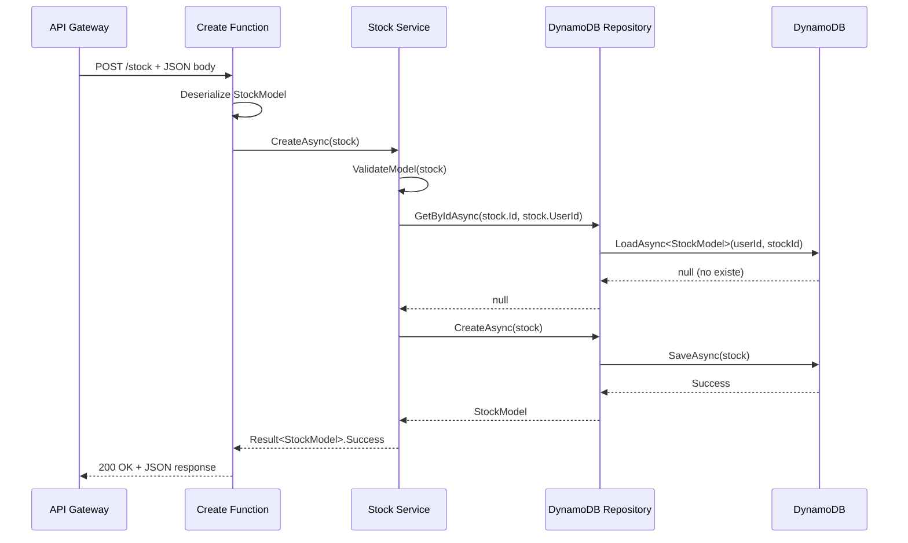

# NiceApiStock - AWS Lambda Stock Management Service

Una API serverless para la gestión de inventario, construida con .NET 8 y AWS Lambda, que proporciona operaciones CRUD para datos de stock almacenados en DynamoDB con soporte para composite keys.

## 🏗️ Architecture Overview

Este proyecto sigue los principios de **Clean Architecture** con una clara separación de responsabilidades:

```
┌─────────────────────┐
│   Lambda Functions  │ ← HTTP entry points, error handling
│ (Create, Get, Update)│
└──────────┬──────────┘
           │
┌──────────▼──────────┐
│     Services        │ ← Business logic, validation
│   (Service)         │
└──────────┬──────────┘
           │
┌──────────▼──────────┐
│   Repositories      │ ← Data access layer
│ (DynamoDbRepository)│
└──────────┬──────────┘
           │
┌──────────▼──────────┐
│     DynamoDB        │ ← Data storage (Composite Key)
└─────────────────────┘
```

## 📁 Project Structure

```
src/
  Functions/
    Create.cs          ← Lambda function para crear stock
    Get.cs             ← Lambda function para consultar stock
    Update.cs          ← Lambda function para actualizar stock
  Models/
    StockModel.cs      ← Modelo de datos con composite key (UserId + Id)
  Services/
    IService.cs        ← Interface del servicio de negocio
    Service.cs         ← Implementación de lógica de negocio
  Repositories/
    IRepository.cs     ← Interface del repositorio
    DynamoDbRepository.cs ← Implementación DynamoDB con composite key
  Utils/
    ResultHandler.cs   ← Manejo centralizado de respuestas HTTP
    StockMessages.cs   ← Constantes de mensajes de error/éxito
```

## 🔄 Flow Explanation

### 1. Request Flow (Create Example)



### 2. Business Logic Components

#### **Service** - Core Business Logic

- **Propósito**: Implementa reglas de negocio y orquesta operaciones de stock
- **Responsabilidades**:
  - Validación de entrada (`ValidateModel`) - Lanza ArgumentException para validaciones
  - Verificación de duplicados antes de crear stock
  - Manejo de operaciones CRUD con composite key (UserId + StockId)
  - Conversión de excepciones a patrón Result

#### **DynamoDbRepository** - Data Access con Composite Key

- **Propósito**: Abstrae operaciones de DynamoDB usando composite key (UserId + Id)
- **Responsabilidades**:
  - Operaciones CRUD con composite key (`GetByIdAsync(stockId, userId)`)
  - Persistencia usando `LoadAsync<StockModel>(userId, stockId)`
  - Persistencia de datos usando `SaveAsync(stock)`

#### **Result<T>** - Patrón de manejo de errores

- **Propósito**: Proporciona una forma limpia de manejar escenarios de éxito/fallo sin excepciones
- **Ventajas**:
  - No se lanzan excepciones para errores de negocio
  - API funcional con métodos `Success()` y `Failure()`
  - Facilita el testing y el debugging
  - Integración con `NiceApp.Common.Models` (librería compartida)
  - Diseño inmutable con constructor privado

```csharp
// Caso de éxito
return Result<StockModel>.Success(stock);

// Caso de error
return Result<StockModel>.Failure("Stock already exists");
```

#### **ResultHandler** - Manejo de respuestas HTTP

- **Propósito**: Centraliza la creación de respuestas HTTP para las funciones Lambda
- **Ventajas**:
  - Formato de respuesta consistente en todos los endpoints
  - Manejo estandarizado de errores HTTP (400, 401, 404, 500)
  - Headers consistentes (`Content-Type: application/json`)
  - Serialización con System.Text.Json

## 🛠️ Key Features

### Stock Management Operations

| Operación  | Endpoint                                  | Descripción                          |
| ---------- | ----------------------------------------- | ------------------------------------ |
| **Create** | `POST /stock`                             | Crea un nuevo item de stock          |
| **Get**    | `GET /stock?id={stockId}&userId={userId}` | Obtiene stock por ID compuesto       |
| **Update** | `PUT /stock`                              | Actualiza un item de stock existente |

**Notas importantes:**

- **Composite Key**: El endpoint `GET /stock` requiere tanto `id` como `userId` debido al composite key de DynamoDB
- **Multitenancy**: Cada usuario (`UserId`) tiene su propio espacio de stock
- **GSI Support**: El campo `Type` está indexado para búsquedas por categoría de producto

### Security Features

- **User Isolation**: Cada stock pertenece a un `UserId` específico (partition key)
- **Input Validation**: Validación exhaustiva de todos los campos de stock
- **Error Sanitization**: Mensajes de error consistentes sin exposición de datos internos

### Reglas de validación de datos

- **UserId**: Requerido, partition key de DynamoDB
- **Id**: Requerido, sort key de DynamoDB
- **Name**: Requerido, nombre del producto
- **Description**: Requerido, descripción detallada
- **Image**: Requerido, URL de la imagen del producto
- **Price**: Requerido, debe ser mayor a 0
- **Type**: Requerido, categoría del producto (indexado con GSI)
- **Count**: Opcional, cantidad en inventario (default: 0)

### Mensajes de error de validación (Inglés)

El sistema proporciona mensajes de error descriptivos:

- `"Stock cannot be empty"` - Stock nulo
- `"Stock name cannot be empty"` - Name requerido
- `"Invalid stock Id"` - Id requerido
- `"UserId cannot be empty"` - UserId requerido
- `"Stock description cannot be empty"` - Description requerido
- `"Stock price must be a valid number greater than zero"` - Price inválido
- `"Stock already exists"` - Duplicado en creación
- `"Stock not found"` - No encontrado en consulta/actualización
- `"Invalid stock data"` - Datos de entrada inválidos

## 🚀 Technology Stack

- **.NET 8**: Modern C# runtime con required properties y top-level programs
- **AWS Lambda**: Serverless compute con `APIGatewayHttpApiV2ProxyRequest`/`APIGatewayHttpApiV2ProxyResponse`
- **API Gateway**: HTTP API endpoints con validación de parámetros
- **DynamoDB**: NoSQL database con composite key y Global Secondary Index
- **AWS SDK v4**: Latest AWS integrations con `DynamoDBContextBuilder` y connection pooling
- **System.Text.Json**: High-performance JSON serialization con opciones personalizadas
- **NiceApp.Common**: Librería compartida para el patrón `Result<T>`

## 🔄 Key Implementation Details

### Connection Pooling para Performance

Todas las funciones Lambda usan connection pooling para optimizar performance:

```csharp
public class CreateStockFunction
{
    // ✅ Static clients para reutilización entre invocaciones
    private static readonly IAmazonDynamoDB _dynamoDbClient = new AmazonDynamoDBClient();
    private static readonly IDynamoDBContext _dynamoDbContext = new DynamoDBContextBuilder()
        .WithDynamoDBClient(() => _dynamoDbClient)
        .Build();

    public CreateStockFunction()
    {
        var stockRepository = new DynamoDbRepository(_dynamoDbContext);
        _stockService = new Service(stockRepository);
    }
}
```

### Composite Key Implementation

El `StockModel` utiliza composite key para multitenancy:

```csharp
[DynamoDBTable("Stock")]
public class StockModel
{
    [DynamoDBHashKey]  // Partition Key
    public required string UserId { get; set; }

    [DynamoDBRangeKey]  // Sort Key
    public required string Id { get; set; }

    [DynamoDBGlobalSecondaryIndexHashKey("TypeIndex")]
    public required string Type { get; set; }  // Para queries por categoría
}
```

### Repository Pattern con Composite Key

```csharp
public async Task<StockModel> GetByIdAsync(string stockId, string userId)
    => await _dbContext.LoadAsync<StockModel>(userId, stockId);  // UserId primero, stockId segundo
```

### Result Pattern Implementation

El patrón `Result<T>` de `NiceApp.Common` proporciona manejo funcional de errores:

```csharp
public async Task<Result<StockModel>> CreateAsync(StockModel stock)
{
    try
    {
        ValidateModel(stock);
        var stockExists = await _stockRepository.GetByIdAsync(stock.Id, stock.UserId);
        if (stockExists != null)
            return Result<StockModel>.Failure(StockMessages.ALREADY_EXISTS);

        await _stockRepository.CreateAsync(stock);
        return Result<StockModel>.Success(stock);
    }
    catch (Exception ex)
    {
        return Result<StockModel>.Failure(ex.Message);
    }
}
```

## 📊 DynamoDB Table Design

### Primary Key Structure

- **Partition Key**: `UserId` - Permite multitenancy
- **Sort Key**: `Id` - Identificador único del stock por usuario

### Global Secondary Index

- **TypeIndex**: Partition Key en `Type` para queries por categoría

### Access Patterns

1. **Get by composite key**: `GetItem(UserId, StockId)`
2. **Get by user**: `Query(UserId)` - Todos los stock de un usuario
3. **Get by type**: `Query(TypeIndex, Type)` - Stock por categoría

### Create DynamoDB Table

```bash
aws dynamodb create-table \
    --table-name Stock \
    --attribute-definitions \
        AttributeName=UserId,AttributeType=S \
        AttributeName=Id,AttributeType=S \
        AttributeName=Type,AttributeType=S \
    --key-schema \
        AttributeName=UserId,KeyType=HASH \
        AttributeName=Id,KeyType=RANGE \
    --global-secondary-indexes \
    "[{
        \"IndexName\": \"TypeIndex\",
        \"KeySchema\": [{\"AttributeName\":\"Type\",\"KeyType\":\"HASH\"}],
        \"Projection\": {\"ProjectionType\":\"ALL\"},
        \"BillingMode\": \"PAY_PER_REQUEST\"
    }]" \
    --billing-mode PAY_PER_REQUEST \
    --region us-east-1
```

## 🔧 Usage Examples

### Create Stock

```bash
POST /stock
Content-Type: application/json

{
  "userId": "user123",
  "id": "stock456",
  "name": "Gaming Laptop",
  "description": "High-performance gaming laptop with RTX 4080",
  "image": "https://example.com/laptop.jpg",
  "price": 2499.99,
  "type": "Electronics",
  "count": 5
}
```

### Get Stock

```bash
GET /stock?id=stock456&userId=user123
```

### Update Stock

```bash
PUT /stock
Content-Type: application/json

{
  "userId": "user123",
  "id": "stock456",
  "name": "Gaming Laptop Pro",
  "description": "Updated high-performance gaming laptop",
  "image": "https://example.com/laptop-pro.jpg",
  "price": 2699.99,
  "type": "Electronics",
  "count": 3
}
```

## 🚦 Error Responses

### 400 Bad Request

```json
{
  "error": "Both 'id' and 'userId' parameters are required"
}
```

### 404 Not Found

```json
{
  "error": "Stock not found"
}
```

### 500 Internal Server Error

```json
{
  "error": "Internal server error"
}
```

## 🔒 Security Considerations

- **Input Validation**: Validación exhaustiva en service layer
- **User Isolation**: Composite key asegura separación por usuario
- **Error Handling**: Mensajes de error que no exponen información sensible
- **Parameter Validation**: Validación estricta de query parameters

## 📈 Performance Optimizations

- **Connection Pooling**: Static AWS clients para reutilización
- **Efficient Queries**: Uso correcto de composite key y GSI
- **Minimal Serialization**: System.Text.Json con opciones optimizadas
- **Lambda Cold Start**: Ready-to-run publishing configuration

## 🛠️ Development Notes

### Required Properties

El proyecto usa C# 11 `required` properties para garantizar datos válidos:

```csharp
public required string UserId { get; set; }
public required string Id { get; set; }
public required string Name { get; set; }
```

### Validation Strategy

- **Business Rules**: Validación en Service layer con excepciones
- **Input Parameters**: Validación en Function layer con Result pattern
- **Database Constraints**: Composite key enforcement por DynamoDB

## 🧪 Testing Recommendations

### Unit Tests

- **Service Layer**: Mock repository, test business logic
- **Repository Layer**: In-memory DynamoDB testing
- **Function Layer**: Mock service, test HTTP handling

### Integration Tests

- **DynamoDB**: Test composite key operations
- **End-to-End**: Test complete request/response cycle

## 📦 Deployment

El proyecto está configurado para deployment con AWS SAM:

- **Runtime**: .NET 8 (Amazon Linux 2)
- **Architecture**: x86_64
- **Memory**: 512MB (recomendado)
- **Timeout**: 30 segundos

---

## 🤝 Contributing

Para contribuir al proyecto:

1. Mantener consistency con patterns existentes
2. Agregar tests para nueva funcionalidad
3. Seguir naming conventions establecidas
4. Documentar cambios en composite key logic
